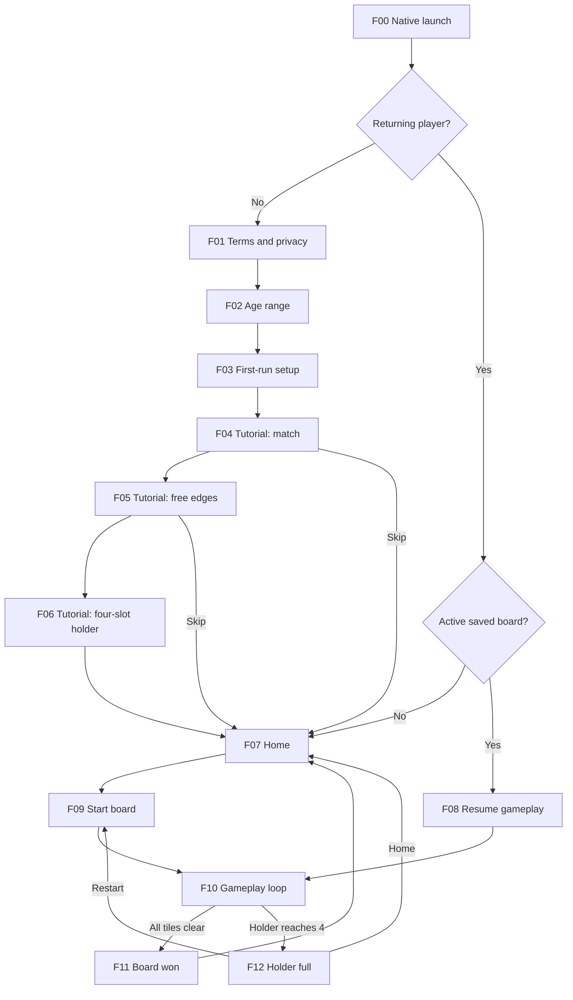

# Product flow map

This is the implementation order and QA boundary for Mahjong Brain. Flow IDs are stable. Use them in issues, tests, screenshots, analytics, and release notes.

## Release tiers

- **P0, first playable App Store/TestFlight build:** onboarding through a complete real game, local persistence, recovery, settings, and accessibility.
- **P1, monetization/account release:** Apple sign-in, verified unlock/purchase/restore, cross-device settings and unlock.
- **P2, parity retention:** daily rewards, rewarded revive, consumable shuffles/hints, expanded levels and engagement loops.

P1 and P2 are mapped now so P0 does not paint us into a corner. They do not block P0 when their entry points are hidden and the app makes no claims about them.

## P0 launch path

## P0 flow contracts

| ID | Flow | Entry | States | Completion proof | Required recovery |
|---|---|---|---|---|---|
| `F00` | Native launch | App process starts | splash, web boot, hydrated | First usable screen appears without white flash or endless spinner | Corrupt local state falls back to legal gate or fresh home safely |
| `F01` | Terms and privacy | First launch | rest, links-open, focused | Acceptance timestamp persists; policy links resolve | Link failure does not falsely record acceptance |
| `F02` | Optional age range | Terms accepted | unanswered, focused, selected | Any range advances once and the prompt is not shown again | No range excludes a player or blocks local play |
| `F03` | First-run setup | Age range answered | loading, offline/local fallback | Local game assets and first seed are ready | Network absence cannot block local play |
| `F04` | Tutorial match | Setup done | rest, tile-picked, pair-clearing | Player sees two identical tiles clear from real holder | Skip routes to home and persists |
| `F05` | Tutorial free edges | Match lesson done | free, blocked, attempted-blocked | Player understands only open-edge tiles move | Blocked attempt gives visible/spoken explanation |
| `F06` | Tutorial holder | Edge lesson done | empty, three-warning, full-demo | Four-slot risk and auto-match are understood | Skip routes to home and persists |
| `F07` | Home | Tutorial done/skipped or result exit | new, returning, offline, settings-open | One tap starts a board | Invalid saved progress falls back to Level 1, not a blank screen |
| `F08` | Resume gameplay | Saved active board | restoring, restored, corrupt-save | Seed, remaining tiles, holder, count, Undo state match prior session | Corrupt replay starts a fresh board with an honest announcement |
| `F09` | Start board | Home or restart | dealing, ready | Deterministic winnable board visible, holder 0/4 | Deal failure retries with a new valid seed |
| `F10` | Gameplay loop | Board ready | empty/1/2/3/full holder, free/blocked/hinted tile, match, undo, shuffle, settings, backgrounded | Legal tap enters holder; pair clears; win/full transitions are correct | Blocked taps no-op; app background persists; unavailable hint/shuffle is truthful |
| `F11` | Board won | Board and holder empty | success, continue | Completion recorded once and home progress increments once | Relaunch cannot double-count completion |
| `F12` | Holder full | Four unmatched held | full, restart, home | No further tile taps; restart/home works | P0 never grants an unverified revive; hidden revive entry if unavailable |
| `F13` | Settings | Home or gameplay | default, changed, large text, reduced motion | Local settings apply immediately and persist | Closing without a network still keeps local settings |
| `F16` | Theme picker | Home appearance action | tiles-tab, backgrounds-tab, selected, confirmed | Tile material and background change immediately and persist | Closing keeps the last confirmed local selection |
| `F14` | Offline/error recovery | Any API-capable state | offline, retrying, recovered, unavailable | Local P0 path remains usable; no mocked success | Retry is bounded and failure copy states what remains safe |
| `F15` | Accessibility traversal | Every P0 screen | VoiceOver, keyboard, Dynamic Type, Reduced Motion, contrast | Reading/focus order follows visual order; all actions named; gameplay operable | 200% text scrolls instead of clipping; motion swaps to opacity |

## Gameplay subflow, F10

1. Determine free tiles from the core board.
2. A legal tap removes one tile from the board and appends it to the four-slot holder.
3. If the new tile matches a held tile, both clear automatically and holder order remains stable.
4. If the holder contains three unmatched tiles, show and announce warning state.
5. If it contains four unmatched tiles, stop input and enter F12.
6. If board and holder are empty, record completion once and enter F11.
7. Undo replays all but the last accepted tap. Relaunch replays the saved accepted-tap history.
8. A hint must recommend a safe holder-aware move. It cannot recommend filling the final slot.
9. Shuffle follows the core contract and never fabricates a purchase, reward, or entitlement.

## P1 mapped flows

| ID | Flow | Required states | Ship gate |
|---|---|---|---|
| `F20` | Optional Apple sign-in | signed-out, native-pending, cancelled, token-rejected, signed-in | Real identity token reaches contract 3; audience, issuer, expiry, algorithm and signature verified |
| `F21` | Settings sync | local-only, syncing, synced, conflict, unavailable | Contract 4 against production store; local settings never lost |
| `F22` | Unlock lookup | unknown, locked, unlocked, unavailable | Contract 9 live; unavailable does not grant or revoke local StoreKit entitlement |
| `F23` | Purchase | product-loading, ready, pending, cancelled, verified, rejected | Real StoreKit 2 transaction; contract 8 chain pinned to Apple Root CA G3; no mock provider in release |
| `F24` | Restore | pending, none, verified, rejected | Restore button visible; unlock only from verified entitlement |
| `F25` | Cross-device unlock | local-owned/server-pending, synced, conflict | Original transaction cannot unlock two accounts; fail closed |
| `F26` | Session analytics | queued, batching, accepted, partially-rejected, offline | Contract 10 live; no account column or behavioral profile |

## P2 mapped flows

| ID | Flow | Required states | Ship gate |
|---|---|---|---|
| `F30` | Levels | current, complete, locked, selected | Progression contract and visual state agree |
| `F31` | Daily reward | claimable, claimed, missed, offline | Server date/streak authoritative; no duplicate claim |
| `F32` | Rewarded revive | offered, ad-loading, completed, rejected, restored-board | Grant only after verified ad completion |
| `F33` | Hint inventory | free, available, consumed, empty, offline | Quantity mutation authoritative and idempotent |
| `F34` | Shuffle inventory | available, purchase, consumed, empty | Verified grant and deterministic board transition |

## P0 App Store readiness checklist

- All `F00`–`F15` automated contract tests pass where automatable.
- Every matching `S00`–`S18` P0 state in `design/QA_REFERENCE.md` has phone and iPad evidence.
- App icon, splash, brand mark, tile faces/back, holder, and core icons are approved, not draft.
- Privacy labels and policies describe the P0 build as shipped, not future P1/P2 behavior.
- P1/P2 entry points are hidden if their real backend/native verification is not configured.
- Archive installs on a clean device, completes first run, finishes a board, survives background/relaunch, and records progress once.
